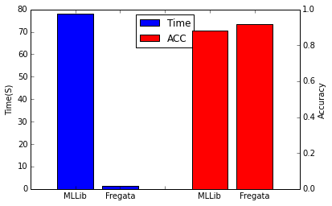
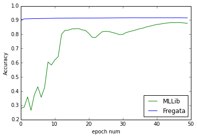

SoftMax
=================
Introduction
-----------
> **[SoftMax](https://en.wikipedia.org/wiki/Softmax_function)** is multi-class classification algorithm , generalization of **[Logistic Regression](https://en.wikipedia.org/wiki/Logistic_regression)** .

> Fregata's Softmax has the advantages below to make it more suitable for industry communities with large datasets:
> 
> - High Speed: it often converges in one data epcho
> - Parameter Free: the learning rate of GSA is self-adaptive

Experiments
------------
> expriment on MNIST, it shows that Fregata's SoftMax is better than MLLib's both in time consuming and auc score.
> 
> 
> 
> 


Example
------------

```scala

import fregata.spark.data.LibSvmReader
import fregata.preprocessing
import fregata.spark.metrics.classification.Accuracy
import fregata.spark.model.classification.SoftMax
import org.apache.spark.{SparkConf, SparkContext}
 
/**
* Created by takun on 16/9/19.
*/

object TestSoftMax {

  def main(args: Array[String]) {
    val conf = new SparkConf().setAppName("soft max")
    val sc = new SparkContext(conf)
    val (_,t1) = LibSvmReader.read(sc,"/Volumes/takun/data/libsvm/mnist2",780)
    val (_,t2) = LibSvmReader.read(sc,"/Volumes/takun/data/libsvm/mnist2.t",780)
    val k = 10
    val train = t1.map{
      case (x,label) => x -> label //preprocessing.normalize(x) -> label
    }
    val testD = t2.map{
      case (x,label) => x -> label //preprocessing.normalize(x) -> label
    }
    val model = SoftMax.run(k.toInt,train)
    val pd = model.softMaxPredict(testD)
    val acc = Accuracy.of( pd.map{
      case ((x,l),(ps,c)) =>
        asNum(c) -> l
    })
    val loss = fregata.spark.loss.log(pd.map{
      case ((x,l),(ps,c)) =>
        (l,asNum(c),ps(l.toInt))
    })
    println( s"Accuracy = $acc ")
    println( s"LogLoss = $loss ")
  }
}


```

    Accuracy = 0.9064 
    LogLoss = 0.34223149144690845
